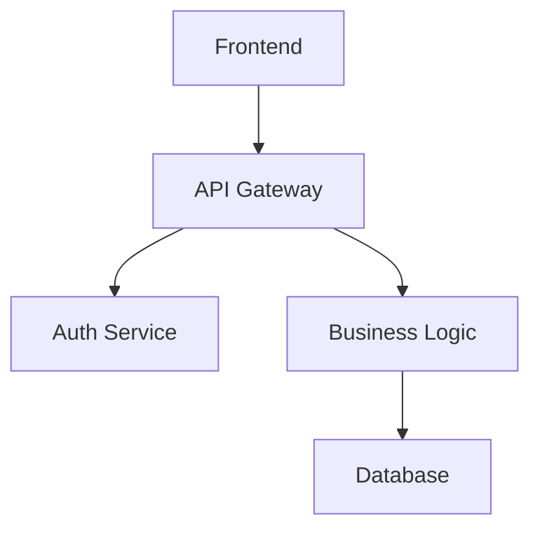
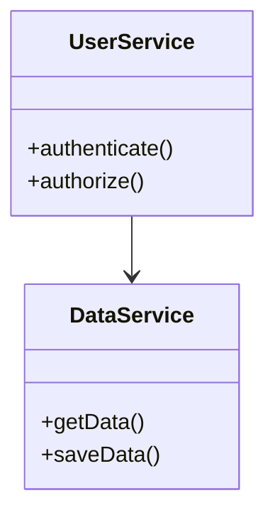
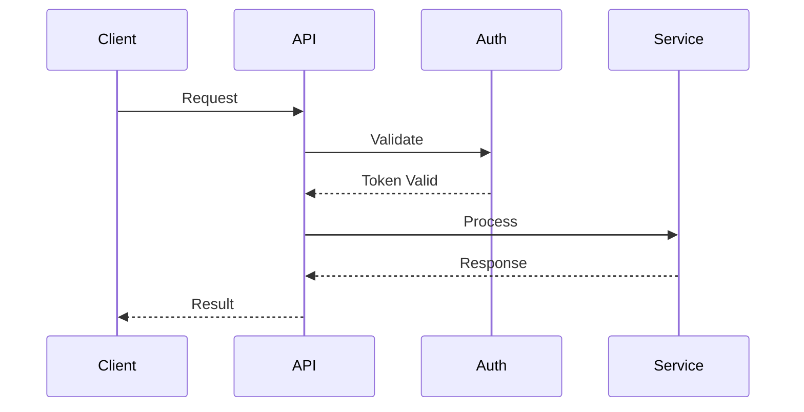

# Codebase Summary

## Overview

This sop analyzes a codebase and generates comprehensive documentation including structured metadata files that describe the system architecture, components, interfaces, and workflows. It can create targeted documentation files like AGENTS.md (README for AI agents), README.md, CONTRIBUTING.md, or generate a complete documentation ecosystem. The documentation is organized to make it easy for AI assistants to understand the system and help with development tasks.

## Parameters

- **output_dir** (optional, default: ".agents/summary"): Directory where documentation will be stored
- **consolidate** (optional, default: true): Whether to create consolidated documentation files
- **consolidate_targets** (optional, default: "AGENTS.md"): Target files for consolidation, comma-separated (e.g., "AGENTS.md, README.md, CONTRIBUTING.md"). Only used if consolidate is true
- **consolidate_prompt** (optional): Description of how to structure the consolidated content for the target file type (e.g., Reference the AGENTS.md example below for the default "consolidate_prompt"). Only used if consolidate is true
- **check_consistency** (optional, default: true): Whether to check for inconsistencies across documents
- **check_completeness** (optional, default: true): Whether to identify areas lacking sufficient detail
- **codebase_path** (optional, default: current directory): Path to the codebase to analyze

**Constraints for parameter acquisition:**
- You MUST ask for all parameters upfront in a single prompt rather than one at a time
- You MUST support multiple input methods including:
  - Direct input: Text provided directly in the conversation
  - File path: Path to a local file containing codebase information
  - Directory path: Path to the codebase to analyze
  - Other methods: You SHOULD be open to other ways the user might want to specify the codebase
- You MUST use appropriate tools to access content based on the input method
- You MUST confirm successful acquisition of all parameters before proceeding
- You MUST validate that the codebase_path exists and is accessible
- If consolidate is false, you MUST inform the user that consolidate_targets and consolidate_prompt will be ignored

## Steps

### 1. Setup and Directory Structure

Initialize the analysis environment and create necessary directory structure.

**Constraints:**
- You MUST validate that the codebase_path exists and is accessible
- You MUST create the output_dir if it doesn't exist
- You MUST inform the user about the directory structure being created
- You MUST create subdirectories for organizing different types of documentation artifacts

### 2. Analyze Codebase Structure

Perform comprehensive analysis of the codebase to understand its structure, components, and relationships.

**Constraints:**
- You MUST use appropriate tools to gather information about the codebase structure
- You MUST identify all packages, modules, and major components in the codebase
- You MUST analyze file organization, directory structure, and architectural patterns
- You MUST identify supported and unsupported programming languages
- You MUST document the technology stack and dependencies
- You MUST create a hierarchical map of the codebase structure using Mermaid diagrams
- You MUST identify key interfaces, APIs, and integration points
- You MUST analyze code patterns and design principles used throughout the codebase
- You MUST use Mermaid diagrams for all visual representations instead of ASCII art
- You MUST document basic codebase information in {output_dir}/codebase_info.md

### 3. Generate Documentation Files

Create comprehensive documentation files for different aspects of the system.

**Constraints:**
- You MUST create a comprehensive knowledge base index file ({output_dir}/index.md) that:
  - Provides explicit instructions for AI assistants on how to use the documentation
  - Contains rich metadata about each file's purpose and content
  - Includes a table of contents with descriptive summaries for each document
  - Explains relationships between different documentation files
  - Guides AI assistants on which files to consult for specific types of questions
  - Contains brief summaries of each file's content to help determine relevance
  - Is designed to be the primary file needed in context for AI assistants to effectively answer questions
- You MUST create documentation files for different aspects of the system:
  - {output_dir}/architecture.md (system architecture and design patterns)
  - {output_dir}/components.md (major components and their responsibilities)
  - {output_dir}/interfaces.md (APIs, interfaces, and integration points)
  - {output_dir}/data_models.md (data structures and models)
  - {output_dir}/workflows.md (key processes and workflows)
  - {output_dir}/dependencies.md (external dependencies and their usage)
- You MUST ensure each documentation file contains relevant information from the codebase analysis
- You MUST use Mermaid diagrams for all visual representations throughout the documentation
- You MUST NOT use ASCII art for any visual elements because Mermaid diagrams render properly in markdown viewers and are easier to maintain

### 4. Review Documentation

Review the documentation for consistency and completeness.

**Constraints:**
- If check_consistency is true, you MUST check for inconsistencies across documents
- If check_completeness is true, you MUST identify areas lacking sufficient detail
- You MUST document any inconsistencies or gaps found in {output_dir}/review_notes.md
- You MUST specifically identify gaps resulting from language support limitations
- You SHOULD use insights from the codebase analysis to identify areas needing more detail
- You MUST provide recommendations for improving documentation quality

### 5. Consolidate Documentation

Create consolidated documentation files if requested.

**Constraints:**
- If consolidate is true, you MUST create consolidated documentation files for each target in consolidate_targets
- For each consolidate_target file that already exists, You MUST read the existing file before generating the new one
- You MUST identify and preserve any sections marked as manually maintained (e.g., "Custom Instructions" sections with HTML comments indicating they are not auto-generated) because human-curated operational knowledge is more valuable than auto-generated content. These sections MUST NOT be modified, rewritten, or removed during consolidation
- If an existing consolidate_target file contains content that appears to be manually added conventions, workflow rules, or operational guidance but is not in a "Custom Instructions" section, you SHOULD migrate that content into the Custom Instructions section of the new file
- You MUST keep consolidated files as concise as possible. Each section MUST contain only information that would change the agent's behavior compared to having no context file. You MUST NOT include general programming best practices that a competent developer would already know because verbose context files increase token cost and agent reasoning time without proportional benefit
- You MUST NOT fabricate or guess acronyms, abbreviations, or initialisms that are not explicitly defined in the codebase or its documentation because hallucinated acronyms mislead agents and humans who rely on the generated documentation
- You MUST NOT include volatile metrics that become stale after code changes, such as lines-of-code counts, file sizes, byte counts, or specific line counts because these create documentation that is immediately outdated and erodes trust in the generated content
- You MUST NOT include specific build, test, lint, or format commands unless they are non-obvious or specific to the repository because common build commands are better provided by centralized tooling and skills rather than duplicated across every context file
- You MUST place consolidated files in the codebase root directory (outside of the output_dir)
- If consolidate_prompt is provided, you MUST use it to guide the structure and content of the consolidated files
- You MUST tailor the consolidated content to each target file type:
  - AGENTS.md: Provide a starting point for navigating the codebase by documenting major subsystems, key entry points, and directory organization so agents can locate relevant code without reading every file. Focus on repo-specific tools, patterns that deviate from language/framework defaults, and information discoverable from config files (CI, linters, git hooks) that agents might otherwise miss. SHOULD avoid duplicating information already present in README.md or CONTRIBUTING.md because redundant content increases token cost, but MAY include brief summaries of critical setup information to make the file more self-contained. Deprioritize exhaustive file-by-file directory listings and generic descriptions that don't aid navigation. You MUST include a "Custom Instructions" section at the end of the file with the following format:
    ```
    ## Custom Instructions

    <!-- This section is maintained by developers and agents during day-to-day work.
         It is NOT auto-generated by codebase-summary and MUST be preserved during refreshes.
         Add project-specific conventions, gotchas, and workflow requirements here. -->
    ```
    On a fresh generation (no existing AGENTS.md), this section MUST be empty (containing only the heading and comment). If an existing AGENTS.md has a Custom Instructions section, its content MUST be preserved exactly as-is in the new file
  - README.md: Focus on project overview, installation, usage, and getting started information
  - CONTRIBUTING.md: Focus on development setup, coding standards, contribution workflow, and guidelines
  - Other files: Adapt content based on filename and consolidate_prompt
- You MUST organize the consolidated content in a coherent structure appropriate for the target audience
- You MUST include a comprehensive table of contents with descriptive summaries
- You MUST add metadata tags to each section to facilitate targeted information retrieval
- You MUST include cross-references between related sections
- You MUST include information from all relevant documentation files
- If consolidate is false, you MUST skip this step and inform the user that no consolidated files will be created

### 6. Summary and Next Steps

Provide a summary of the documentation process and suggest next steps.

**Constraints:**
- You MUST summarize what has been accomplished
- You MUST suggest next steps for using the documentation
- You MUST provide guidance on maintaining and updating the documentation
- You MUST include specific instructions for adding the documentation to AI assistant context:
  - Recommend using the index.md file as the primary context file
  - Explain how AI assistants can leverage the index.md file as a knowledge base to find relevant information
  - Emphasize that the index.md contains sufficient metadata for assistants to understand which files contain detailed information
  - Provide example queries that demonstrate how to effectively use the documentation
- If consolidate is true, you MUST provide guidance on using the consolidated files

## Examples

### Example Input (Default AGENTS.md)
```
output_dir: ".agents/summary"
consolidate: true
consolidate_targets: "AGENTS.md"
consolidate_prompt: "Create a concise AGENTS.md that provides a starting point for navigating the codebase. Document major subsystems, key entry points, and directory organization so agents can locate relevant code without reading every file. Include: (1) directory overview and component map, (2) repo-specific tools and scripts found in the codebase, (3) patterns that deviate from language/framework defaults, (4) information discoverable from config files (CI, linters, git hooks) that agents might otherwise miss. Do NOT include: exhaustive file-by-file directory listings, generic component descriptions that don't aid navigation, general programming best practices, volatile metrics like lines-of-code counts or file sizes, standard build/test/lint commands that are common to the language or framework, or fabricated acronyms. End with an empty 'Custom Instructions' section for human/agent-maintained conventions."
codebase_path: "/path/to/project"
```

### Example Output (Generate Mode)
```
Setting up directory structure...
✅ Created directory .agents/summary/
✅ Created subdirectories for documentation artifacts

Analyzing codebase structure...
✅ Found 15 packages across 3 programming languages
✅ Identified 45 major components and 12 key interfaces
✅ Codebase information saved to .agents/summary/codebase_info.md

Generating documentation files...
✅ Created index.md with knowledge base metadata
✅ Generated architecture.md, components.md, interfaces.md
✅ Generated data_models.md, workflows.md, dependencies.md

Reviewing documentation...
✅ Consistency check complete
✅ Completeness check complete
✅ Review notes saved to .agents/summary/review_notes.md

Consolidating documentation...
✅ Created AGENTS.md optimized for AI coding assistants
✅ Included comprehensive project context and development guidance

Summary and Next Steps:
✅ Documentation generation complete!
✅ To use with AI assistants, add .agents/summary/index.md to context
✅ AGENTS.md provides comprehensive guidance for AI coding assistance
```

### Example Input (README.md)
```
consolidate_targets: "README.md"
consolidate_prompt: "Create a user-friendly README that explains the project purpose, installation, and usage"
```

### Example Input (No Consolidation)
```
consolidate: false
check_consistency: true
check_completeness: true
```

### Example Output Structure
```
AGENTS.md (consolidated file in root directory)
.agents/summary/
├── index.md (knowledge base index)
├── codebase_info.md
├── architecture.md
├── components.md
├── interfaces.md
├── data_models.md
├── workflows.md
├── dependencies.md
└── review_notes.md
```

### Example Mermaid Diagram Types
The documentation will include various Mermaid diagram types:

**Architecture Overview:**


**Component Relationships:**


**API Workflows:**


## Troubleshooting

### Large Codebase Performance
For very large codebases that take significant time to analyze:
- You SHOULD provide progress updates during analysis
- You SHOULD suggest focusing on specific directories or components if performance becomes an issue
- Consider running with consolidate=false to generate individual files faster

### Existing AGENTS.md
If the generated AGENTS.md doesn't properly preserve existing custom content:
- Check that the Custom Instructions section has the expected HTML comment marker
- If custom content was in non-standard locations, verify it was migrated to the Custom Instructions section
- Consider manually moving important content into the Custom Instructions section before re-running

### Consolidation Issues
If consolidation fails or produces poor results:
- Check that consolidate_prompt provides clear guidance for the target file type
- Verify that all source documentation files were generated successfully
- Consider using a more specific consolidate_prompt for better results

### Missing Documentation Sections
If certain aspects of the codebase are not well documented:
- Check the review_notes.md file for identified gaps
- Consider running with check_completeness=true to identify missing areas
- Review the codebase analysis to ensure all components were properly identified