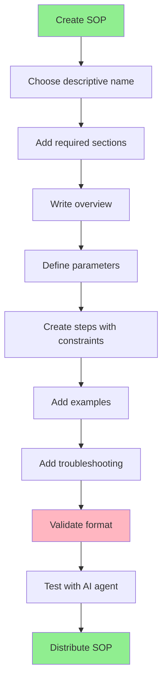

# Agent SOP Author

## Overview

Agent SOPs (Standard Operating Procedures) are markdown-based instruction sets that guide AI agents through sophisticated workflows using natural language, parameterized inputs, and constraint-based execution. This skill teaches you how to create (or update), structure, and validate Agent SOPs that work across different AI systems.

## Usage

When working with Agent SOPs and need to:
- Create new workflow automation SOPs
- Update existing workflow automation SOPs
- Structure multi-step agent workflows
- Apply RFC 2119 constraints (MUST, SHOULD, MAY)
- Validate SOP format and structure
- Convert workflows into reusable templates
- Ensure SOPs work across AI systems (Claude, Kiro, Cursor, etc.)

## Core Concepts

### What is an Agent SOP?

An Agent SOP is a standardized markdown file (`.sop.md`) that defines:
- **Clear objectives** with detailed overviews
- **Parameterized inputs** for flexible reuse
- **Step-by-step instructions** with RFC 2119 constraints
- **Examples and troubleshooting** for reliable execution
- **Multi-modal distribution** (MCP tools, Anthropic Skills, Python modules)

### Key Features

**RFC 2119 Constraints**: Use standardized keywords (MUST, SHOULD, MAY) to provide precise control over agent behavior without rigid scripting.

**Parameterization**: Accept parameters that customize behavior for different projects, teams, or requirements.

**Resumability**: Document progress as agents work, making it easy to understand and resume if interrupted.

## Creating Agent SOPs

### File Location

You **MUST** check for an `agent-sops/` directory in the current working directory:
- If `agent-sops/` exists, You **MUST** write the SOP file there
- If `agent-sops/` does not exist, You **MAY** write the SOP in the current directory or ask the user where to save it

### File Naming

You **MUST** follow these naming conventions:
- Use `.sop.md` file extension
- Use kebab-case for filenames (e.g., `code-assist.sop.md`, `idea-honing.sop.md`)
- Choose descriptive names that indicate the SOP's purpose

### Validation

**You MUST run validate-sop.sh after EVERY change:**

The validation script is located in the same directory as this SKILL.md file. When you read this skill, you will know the full path to SKILL.md, and the validation script is in that same directory.

```bash
<skill-directory>/validate-sop.sh path/to/your-sop.sop.md
```

You **MUST** fix all errors (❌) before proceeding. You **SHOULD** address warnings (⚠️) when possible.

### Required Structure

Every Agent SOP **MUST** include these sections in order:

```markdown
# [SOP Name]

## Overview
[Concise description of what the SOP does and when to use it]

## Parameters

- **required_param** (required): Description
- **optional_param** (optional, default: "value"): Description

**Constraints for parameter acquisition:**
- If all required parameters are already provided, You MUST proceed to the Steps
- If any required parameters are missing, You MUST ask for them before proceeding
- When asking for parameters, You MUST request all parameters in a single prompt
- When asking for parameters, You MUST use the exact parameter names as defined

## Steps
### 1. [Step Name]
Description of what happens in this step.

**Constraints:**
- You MUST [specific requirement]
- You SHOULD [recommended behavior]
- You MAY [optional behavior]

## Examples
[Concrete usage examples]

## Troubleshooting
[Common issues and solutions]
```

### Parameters Section

You **MUST** define parameters using this format:

```markdown
## Parameters

- **parameter_name** (required): Description of required input
- **another_param** (required): Description
- **optional_param** (optional): Description of optional input
- **with_default** (optional, default: "default_value"): Description

**Constraints for parameter acquisition:**
- If all required parameters are already provided, You MUST proceed to the Steps
- If any required parameters are missing, You MUST ask for them before proceeding
- When asking for parameters, You MUST request all parameters in a single prompt
- When asking for parameters, You MUST use the exact parameter names as defined
```

**Parameter naming rules:**
- You **MUST** use lowercase letters
- You **MUST** use underscores for spaces (snake_case)
- You **MUST** be descriptive of purpose
- You **MUST** list required parameters before optional ones

**The Constraints for parameter acquisition section:**
- You **MUST** include this section in every Parameters section
- You **MUST** include these directives:
  - "If all required parameters are already provided, You MUST proceed to the Steps"
  - "If any required parameters are missing, You MUST ask for them before proceeding"
  - "When asking for parameters, You MUST request all parameters in a single prompt"
  - "When asking for parameters, You MUST use the exact parameter names as defined"
- You **MAY** add additional constraints for flexible input methods:

```markdown
**Constraints for parameter acquisition:**
- If all required parameters are already provided, You MUST proceed to the Steps
- If any required parameters are missing, You MUST ask for them before proceeding
- When asking for parameters, You MUST request all parameters in a single prompt
- When asking for parameters, You MUST use the exact parameter names as defined
- You MUST support multiple input methods including:
  - Direct input: Text provided directly
  - File path: Path to a local file
  - URL: Link to an internal resource
- You MUST use appropriate tools to access content
- You MUST confirm successful acquisition before proceeding
- You SHOULD save acquired data to a consistent location
```

### Steps Section

You **MUST** structure steps with:
1. Numbered heading (### 1., ### 2., etc.)
2. Step name
3. Natural language description
4. **Constraints:** section with RFC 2119 keywords

**Example:**

```markdown
### 1. Setup
Initialize the project environment and create necessary structures.

**Constraints:**
- You MUST validate directory structure exists
- You MUST create missing directories
- You MUST NOT proceed if directory creation fails
- You SHOULD log all setup actions
- You MAY skip validation if --force flag is provided
```

**For conditional logic:**

```markdown
### 3. Conditional Processing
If validation passes, proceed with processing. Otherwise, report errors.

**Constraints:**
- You MUST check validation status before proceeding
- If validation passes, You MUST process the data
- If validation fails, You MUST report specific errors
- You MUST NOT continue with invalid data
```

### RFC 2119 Keywords

You **MUST** use these keywords as defined in RFC 2119:

- **MUST** / **REQUIRED**: Absolute requirement
- **MUST NOT** / **SHALL NOT**: Absolute prohibition
- **SHOULD** / **RECOMMENDED**: Strong recommendation (may have valid reasons to ignore)
- **SHOULD NOT** / **NOT RECOMMENDED**: Strong discouragement (may have valid reasons to accept)
- **MAY** / **OPTIONAL**: Truly optional item

### Negative Constraints

You **MUST** provide context when using negative constraints:

**Good (with context):**
```markdown
- You MUST NOT use ellipses (...) because your output will be read aloud by text-to-speech
- You SHOULD NEVER delete Git history files since this could corrupt the repository
- You MUST NOT run `git push` because this could publish unreviewed code
```

**Bad (without context):**
```markdown
- You MUST NOT use ellipses
- You SHOULD NEVER delete Git files
- You MUST NOT run git push
```

**Common contexts for negative constraints:**
- Technical limitations: "because the system cannot handle..."
- Security risks: "since this could expose sensitive data..."
- Data integrity: "as this could corrupt important information..."
- User experience: "because users will be confused by..."
- Compatibility: "since this breaks integration with..."
- Performance: "as this could cause significant slowdowns..."

### Examples Section

You **SHOULD** include concrete examples showing:
- Example input parameters
- Expected output or behavior
- Common usage patterns

```markdown
## Examples

### Example 1: Basic Usage
**Input:**
- task_description: "Create user authentication system"
- mode: "interactive"

**Expected Behavior:**
Agent will guide through TDD workflow, creating tests first, then implementation.

### Example 2: Automated Mode
**Input:**
- task_description: "Fix bug in payment processing"
- mode: "auto"

**Expected Behavior:**
Agent will automatically implement fix following established patterns.
```

### Troubleshooting Section

You **SHOULD** include common issues and solutions:

```markdown
## Troubleshooting

### Parameter Validation Fails
If parameter validation fails, check that:
- All required parameters are provided
- Parameter names use snake_case
- Values match expected types

### Step Execution Hangs
If a step appears to hang:
- Check for missing tool permissions
- Verify file paths are accessible
- Review constraint requirements
```

## Interactive SOPs

For SOPs requiring user interaction:

1. You **SHOULD** clearly indicate when user interaction is expected
2. You **MUST** specify how to handle user responses
3. You **SHOULD** specify where to save interaction records

**Example:**

```markdown
### 2. Requirements Clarification
Guide the user through questions to refine their initial idea.

**Constraints:**
- You MUST ask one question at a time
- You MUST append each Q&A to "idea-honing.md"
- You SHOULD adapt follow-up questions based on previous answers
- You MUST continue until sufficient detail is gathered
```

## Best Practices

You **SHOULD** follow these practices when authoring SOPs:

1. **Keep steps focused**: Each step should accomplish one clear objective
2. **Use clear constraints**: Be specific about requirements vs recommendations
3. **Provide examples**: Show concrete usage for complex workflows
4. **Natural language**: Write descriptions that are easy to understand
5. **Minimize complexity**: Avoid deeply nested conditional logic
6. **Specify artifacts**: Include file paths for all created artifacts
7. **Test thoroughly**: Validate SOPs work across different AI systems
8. **Document edge cases**: Include troubleshooting for common issues

## Quick Reference

| Element | Format | Required |
|---------|--------|----------|
| File extension | `.sop.md` | Yes |
| Title | `# SOP Name` | Yes |
| Overview | `## Overview` | Yes |
| Parameters | `## Parameters` | Yes |
| Steps | `## Steps` with `### N.` | Yes |
| Constraints | `**Constraints:**` with RFC 2119 | Yes |
| Examples | `## Examples` | Recommended |
| Troubleshooting | `## Troubleshooting` | Recommended |

## Common Patterns

### Before: Unstructured Prompt
```markdown
Please implement a user authentication system using TDD.
Make sure to write tests first and follow best practices.
```

### After: Structured SOP
```markdown
# Code Assist

## Overview
This SOP guides implementation using test-driven development.

## Parameters
- **task_description** (required): Description of task
- **mode** (optional, default: "interactive"): "interactive" or "auto"

## Steps
### 1. Setup
Initialize project environment.

**Constraints:**
- You MUST validate directory structure
- You MUST create test directory if missing
- You MUST NOT proceed if setup fails

### 2. Test Creation
Create tests based on requirements.

**Constraints:**
- You MUST write tests before implementation
- You SHOULD follow existing test patterns
- You MAY add additional edge case tests
```

## Common Mistakes

### Missing Context in Negative Constraints
**Problem:** Using MUST NOT without explaining why.
**Fix:** Always provide context: "You MUST NOT X because Y"

### Vague Parameter Descriptions
**Problem:** "input_data (required): The data"
**Fix:** "input_data (required): JSON object containing user profile fields (name, email, role)"

### Mixing Requirement Levels
**Problem:** Using MUST for optional behaviors or MAY for critical requirements.
**Fix:** Use RFC 2119 keywords precisely - MUST for absolute requirements, SHOULD for recommendations, MAY for optional.

### Missing Examples
**Problem:** Complex workflow without concrete usage examples.
**Fix:** Include at least one complete example showing input parameters and expected behavior.

### Overly Complex Steps
**Problem:** Single step trying to accomplish multiple objectives with nested conditionals.
**Fix:** Break into multiple focused steps, each with clear constraints.

## Visual Workflow



## The Bottom Line

Agent SOPs transform complex workflows into reusable, shareable instructions that work across different AI systems. They use standardized markdown format with RFC 2119 constraints to provide precise control while preserving agent reasoning ability.

When creating SOPs, focus on clear structure, specific constraints with context, and concrete examples. Test thoroughly across different AI systems to ensure reliability.
