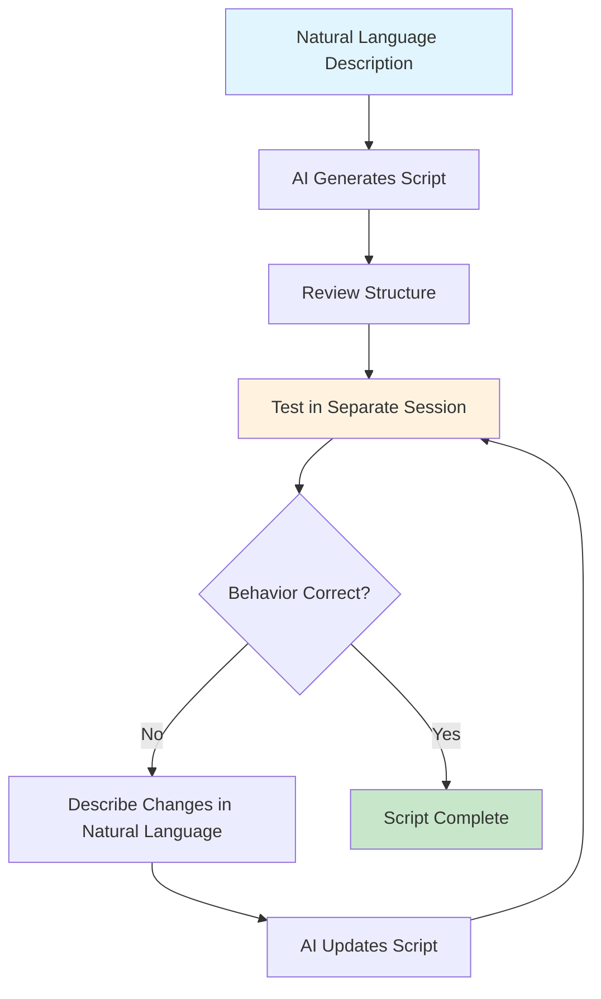

# Agent SOP Authoring

## Overview

Agent SOPs use AI-assisted authoring that leverages natural language interaction rather than manual prompt engineering. You create SOPs by describing workflows in plain English and iterating through conversational refinement.

## Usage

When you need to:
- Create new `.sop.md` automation files
- Convert manual workflows into reusable agent SOPs
- Automate multi-step processes for AI agents
- Share standardized workflows across teams
- Iterate on existing agent SOP behavior

When NOT to use:
- Simple one-step tasks (use direct tool calls)
- Deterministic operations (use shell/python scripts)
- Complex branching logic (consider multiple focused scripts)

## Instructions

### Prerequisites

You **MUST** have access to the script format rule before authoring:
- Load the script format rule into your context
- Ensure you understand RFC 2119 constraint keywords (MUST, SHOULD, MAY)
- Have access to relevant MCP tools for the automation

### AI-Assisted Authoring Process

You **MUST** follow this iterative development approach:

1. **Start with Natural Language Description**
   - Describe the workflow you want to automate in plain English
   - Focus on the end goal, not implementation details
   - Include any specific constraints or requirements

2. **Generate Initial SOP**
   - Ask the AI agent to create an agent SOP based on your description
   - The agent will use the SOP format rule to structure it properly
   - Review the generated structure and parameters

3. **Iterative Refinement**
   - Test the script in a separate AI session
   - Describe needed changes in natural language
   - Avoid technical specifications - use plain English
   - Repeat until behavior matches expectations

### Dual-Session Workflow

You **MUST** use separate sessions for authoring and testing:

**Authoring Session:**
- Keep script format rule in context
- Focus on script creation and modification
- Use natural language for change requests

**Testing Session:**
- Clean context without authoring pollution
- Execute script iterations
- Validate behavior and identify issues

### Script Structure Requirements

Your scripts **MUST** include:
- File extension: `.sop.md`
- Overview section explaining purpose
- Parameters section with required/optional inputs
- Steps section with numbered workflow
- RFC 2119 constraints (MUST, SHOULD, MAY)

### Parameter Guidelines

You **MUST** define parameters clearly:
- **required_param** (required): Essential inputs
- **optional_param** (optional): Non-essential inputs
- **param_with_default** (optional, default: "value"): Defaulted inputs

### Constraint Framework

You **MUST** use RFC 2119 keywords appropriately:
- **MUST**: Absolute requirements
- **SHOULD**: Strong recommendations
- **MAY**: Optional actions

You **SHOULD** provide context for negative constraints explaining why something should not be done.

## Supporting Files

### agent-sop-format.md
The standardized format rule that teaches AI agents proper Agent SOP structure. Read this file before authoring.

**When to use:** Always before creating or modifying agent SOPs

**How to load:** Read `./agent-sop-format.md` directly using file reading tools

## Core Concepts

### AI-Assisted vs Manual Authoring
- **Recommended:** Use AI agents to write scripts based on natural language
- **Not Recommended:** Manual prompt engineering or complex technical specifications
- **Key Benefit:** Natural language iteration is faster and more intuitive

### SOP Format Rule
- Standardizes structure across all Agent SOPs
- Enables AI agents to author other agent SOPs
- Improves model consistency using RFC 2119 keywords
- Required for reliable SOP generation

### Iterative Development
- Start simple with basic workflow description
- Test frequently in separate sessions
- Refine through natural language feedback
- Focus on behavior, not implementation

### Separation of Concerns
- Authoring: Script creation and modification
- Testing: Script execution and validation
- Benefits: Clean testing environment, faster iteration

## Visual Diagrams



## Quick Reference

| Task | Action |
|------|--------|
| Start new script | Describe workflow in natural language |
| Refine behavior | Test → describe changes → update |
| Add error handling | Describe failure scenarios to handle |
| Optimize performance | Identify inefficient patterns, request improvements |
| Share SOP | Save as `.sop.md` in shared location |

## Common Patterns

### Before: Manual Prompt Engineering
```text
Create a complex prompt with specific instructions for looking up user information, 
handling edge cases, formatting output, and managing errors...
```

### After: Natural Language Authoring
```text
"Write an agent SOP that looks up a user's phonetool given their login and 
provides a summary including their immediate L10 VP."
```

### Before: Technical Specifications
```text
Use the read_internal_website tool to access https://phonetool.amazon.com/users/{login}
and parse the manager hierarchy until you find a level 10...
```

### After: Natural Language Refinement
```text
"You can use read_internal_website to go straight to each login's phonetool page. 
Walk up the manager chain until you see a level 10 VP."
```

## Common Mistakes

### Writing SOPs Manually
**Problem:** Trying to author agent SOPs by hand without AI assistance
**Fix:** Use AI agents with SOP format rule to generate and iterate SOPs

### Complex Initial Requests
**Problem:** Trying to specify every detail in the first request
**Fix:** Start simple, iterate through natural language refinement

### Single Session Development
**Problem:** Authoring and testing in the same AI session
**Fix:** Use separate sessions for clean testing environment

### Technical Change Requests
**Problem:** Describing changes using technical specifications
**Fix:** Use natural language to describe desired behavior changes

### Missing Script Format Rule
**Problem:** AI generates inconsistent or incorrect script structure
**Fix:** Always load script format rule into AI context before authoring

### Skipping Testing Iterations
**Problem:** Assuming generated script works without validation
**Fix:** Test each iteration and refine based on actual behavior
